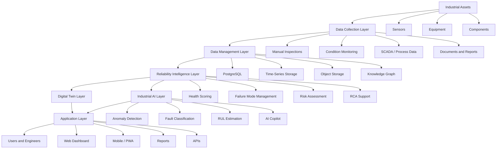

# ARIP Architecture Overview

## Autonomous Reliability Intelligence Platform

ARIP is designed as an open-source Industrial Operating System for reliability intelligence, condition monitoring, asset intelligence, digital twins, industrial AI, and autonomous maintenance.

The architecture is asset-centric, knowledge-centric, offline-first, and designed for industrial environments where reliability, traceability, cybersecurity, and engineering explainability are critical.

---

## Architectural Goals

The main goals of the ARIP architecture are:

* Provide a unified platform for industrial reliability and maintenance intelligence
* Connect assets, components, measurement points, inspections, failures, and maintenance actions
* Support multimodal condition monitoring data
* Enable digital twin modeling for industrial assets
* Support explainable industrial AI and decision support
* Operate in restricted or offline industrial environments
* Align with industrial standards and engineering practices
* Remain vendor-neutral and extensible

---

## High-Level Architecture



---

## Core Architectural Layers

### 1. Asset Layer

The asset layer represents the physical industrial world.

It includes:

* Sites
* Plants
* Areas
* Systems
* Equipment
* Sub-equipment
* Components
* Failure locations
* Measurement points
* Sensors

This layer is the foundation of the entire platform.

---

### 2. Data Collection Layer

This layer collects data from different industrial sources.

Supported data sources may include:

* Manual inspection records
* Vibration measurements
* Temperature readings
* Thermography images
* Oil analysis reports
* Ultrasound measurements
* Process variables
* SCADA / PLC data
* Maintenance history
* Technical documents

---

### 3. Data Management Layer

This layer stores and organizes all industrial data.

Planned data storage components include:

* PostgreSQL for transactional data
* Time-series database for sensor and trend data
* Object storage for files, images, documents, and reports
* Graph database for industrial knowledge and relationships
* Local offline storage for field data entry

---

### 4. Reliability Intelligence Layer

This layer transforms raw data into reliability and maintenance intelligence.

It includes:

* Asset health scoring
* Failure mode libraries
* Risk assessment
* Root cause analysis support
* Maintenance recommendation logic
* Historical case comparison
* Criticality-based prioritization

---

### 5. Digital Twin Layer

ARIP is designed to support multiple digital twin perspectives for each asset:

* Physical Twin
* Functional Twin
* Process Twin
* Reliability Twin
* Energy Twin
* AI Twin

These twins help represent different dimensions of asset behavior and condition.

---

### 6. Industrial AI Layer

The AI layer supports intelligent diagnostics and decision support.

Planned capabilities include:

* Anomaly detection
* Fault classification
* Remaining useful life estimation
* Time-series forecasting
* Explainable diagnostics
* Causal reasoning
* Retrieval-augmented generation for technical documents
* AI-assisted report generation

---

### 7. Application Layer

The application layer provides user-facing tools.

It includes:

* Web dashboard
* Mobile-first PWA
* Equipment registry interface
* Condition monitoring forms
* Trend dashboards
* Health score dashboards
* Maintenance recommendation views
* Technical reports
* Industrial copilot interface

---

### 8. Integration Layer

ARIP is intended to integrate with industrial and enterprise systems.

Potential integrations include:

* CMMS / EAM
* ERP
* SCADA
* OPC UA
* MQTT
* Modbus
* Document repositories
* External analytics tools

---

## Initial Implementation Architecture

The first implementation phase focuses on a practical and maintainable architecture.

Planned technology stack:

* Backend: FastAPI
* Database: PostgreSQL
* ORM: SQLAlchemy
* Migrations: Alembic
* Frontend: React
* Language: TypeScript
* UI: Material UI
* Offline support: PWA and IndexedDB
* Deployment: Docker
* Future orchestration: Kubernetes or K3s

---

## Asset Hierarchy Model

The initial asset hierarchy follows an industrial asset-centric structure:

```text
Site
└── Plant
    └── Area
        └── System
            └── Equipment
                └── Component
                    └── Measurement Point
```

Future extensions may include:

```text
Enterprise
└── Site
    └── Plant
        └── Area
            └── Process Unit
                └── System
                    └── Equipment
                        └── Sub-Equipment
                            └── Component
                                └── Failure Location
                                    └── Measurement Point
                                        └── Sensor
```

---

## Condition Monitoring Domains

ARIP is designed to support multimodal condition monitoring.

Initial domains include:

* Vibration
* Temperature
* Thermography
* Oil analysis
* Ultrasound
* Visual inspection
* Process data

Future domains may include:

* Acoustic emission
* Motor current signature analysis
* Electrical signature analysis
* Power quality
* Drone inspection
* Robotic inspection
* Computer vision

---

## Knowledge Graph Concept

The ARIP knowledge graph connects industrial reliability entities such as:

* Assets
* Components
* Failure modes
* Root causes
* Symptoms
* Indicators
* Measurement points
* Maintenance tasks
* Spare parts
* Historical cases

Example relationship model:

```text
Asset -> has component -> Component
Component -> may fail by -> Failure Mode
Failure Mode -> caused by -> Root Cause
Failure Mode -> detected by -> Symptom
Symptom -> measured at -> Measurement Point
Failure Mode -> mitigated by -> Maintenance Action
```

---

## Security Architecture Principles

ARIP is designed with industrial cybersecurity awareness.

Security principles include:

* Role-based access control
* Least privilege
* Audit logging
* Secure authentication
* Secure API communication
* Data access control
* Offline data protection
* OT / IT separation awareness
* IEC 62443 alignment

---

## Offline-First Architecture

ARIP is intended for industrial environments where connectivity may be restricted or unavailable.

Offline-first features may include:

* Local inspection data entry
* Local equipment cache
* IndexedDB storage
* Sync queue
* Conflict handling
* Background synchronization
* Local-first mobile workflow

---

## Standards Alignment

ARIP architecture is designed with awareness of:

* ISO 14224
* ISO 55000
* ISO 31000
* IEC 62443
* ISA-95
* OPC UA

These standards guide the architecture but do not imply formal certification.

---

## Architecture Status

This architecture is currently in the early open-source design and implementation phase.

The next development steps include:

* Completing the asset hierarchy model
* Defining database schemas
* Designing API contracts
* Creating backend service skeletons
* Creating frontend dashboard skeletons
* Adding condition monitoring data models
* Adding reliability intelligence documentation
