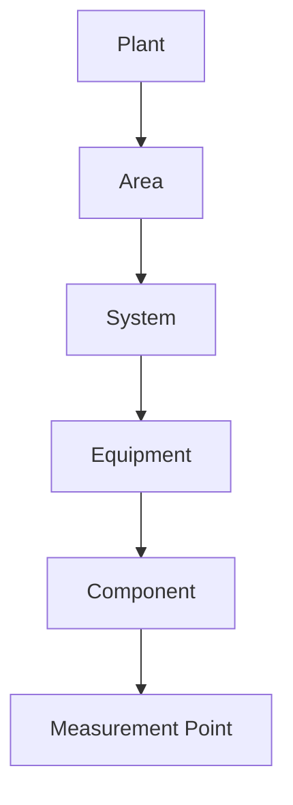
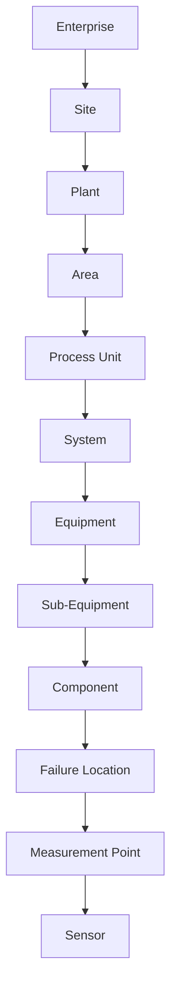
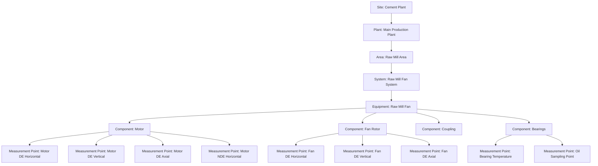
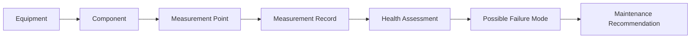

# ARIP Asset Hierarchy Diagram

## Overview

This document provides the initial Asset Hierarchy Diagram for ARIP — Autonomous Reliability Intelligence Platform.

The asset hierarchy is the foundation of ARIP. Every inspection record, measurement point, failure mode, condition monitoring value, reliability assessment, digital twin state, and AI recommendation should be connected to asset context.

---

## Practical Initial Asset Hierarchy

The first implementation of ARIP uses a practical industrial hierarchy:



---

## Extended Enterprise Asset Hierarchy

The long-term ARIP hierarchy can be extended to support multi-site and multi-industry use cases.



---

## Cement Industry Example

Example hierarchy for a Raw Mill Fan System:



---

## Asset Context for Condition Monitoring

Condition monitoring records should always be connected to measurement points.



---

## Key Metadata

Each asset hierarchy entity may include:

* Unique identifier
* Business code
* Name
* Description
* Parent relationship
* Status
* Criticality
* Location
* Manufacturer
* Model
* Serial number
* Installation date
* Health score
* Risk score
* Last inspection date
* Last maintenance date

---

## Design Notes

ARIP should use both:

* A technical UUID for software-level uniqueness
* A business code for industrial users and plant teams

Example business codes:

```text
RM-FN-431
KILN-DRV-01
CM-GBX-102
COMP-AIR-01
```

---

## Related Documentation

* [Architecture Overview](../architecture-overview.md)
* [Asset Hierarchy Model](../asset-hierarchy-model.md)
* [Platform Architecture Diagram](platform-architecture.md)
* [C4 Context Diagram](c4-context.md)
* [C4 Container Diagram](c4-container.md)
* [Condition Monitoring Domain Model](../../condition-monitoring/condition-monitoring-domain-model.md)
