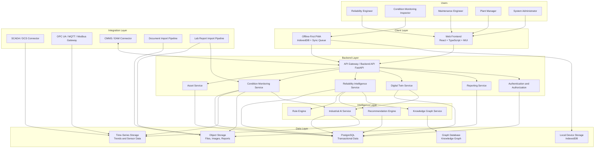

# ARIP C4 Container Diagram

## Overview

This document provides the initial C4 Container Diagram for ARIP — Autonomous Reliability Intelligence Platform.

The C4 Container Diagram shows the major deployable and logical containers that make up the ARIP platform.

---

## Container Diagram

---

## Container Responsibilities

### Web Frontend

The Web Frontend provides the main user interface for engineers, managers, administrators, and contributors.

It includes:

* Dashboard views
* Asset registry views
* Condition monitoring views
* Reliability intelligence views
* Digital twin views
* Reports
* Settings and administration

Recommended technologies:

* React
* TypeScript
* Material UI
* React Router
* API client layer

---

### Offline-First PWA

The Offline-First PWA supports field inspection and condition monitoring workflows in low-connectivity industrial environments.

It includes:

* Local equipment cache
* Local measurement point cache
* Inspection drafts
* Local sync queue
* Sync status
* Offline form entry

Recommended technologies:

* React
* TypeScript
* IndexedDB
* Dexie.js
* Service Worker
* PWA manifest

---

### Backend API

The Backend API is the main server-side entry point for ARIP.

It exposes REST or future event-based APIs for:

* Assets
* Equipment hierarchy
* Measurement points
* Inspection records
* Condition monitoring data
* Reliability intelligence
* Digital twin state
* Reports
* Authentication and authorization

Recommended technologies:

* FastAPI
* Pydantic
* SQLAlchemy
* Alembic
* PostgreSQL

---

### Asset Service

The Asset Service manages the industrial asset hierarchy.

It is responsible for:

* Plants
* Areas
* Systems
* Equipment
* Components
* Measurement points
* Asset metadata
* Equipment criticality
* Asset status

---

### Condition Monitoring Service

The Condition Monitoring Service manages inspection and monitoring records.

It is responsible for:

* Vibration records
* Temperature records
* Thermography metadata
* Oil analysis records
* Ultrasound records
* Visual inspection records
* Thresholds
* Baselines
* Health assessments

---

### Reliability Intelligence Service

The Reliability Intelligence Service transforms asset and condition data into engineering decisions.

It is responsible for:

* Failure modes
* Symptoms
* Root causes
* Risk scores
* Health scores
* RCA support
* Maintenance recommendations
* Historical case comparison

---

### Digital Twin Service

The Digital Twin Service manages asset state representations.

It is responsible for:

* Physical Twin state
* Functional Twin state
* Process Twin state
* Reliability Twin state
* Energy Twin state
* AI Twin state
* Twin update events

---

### Industrial AI Service

The Industrial AI Service supports explainable diagnostics and decision support.

It may include:

* Anomaly detection
* Fault classification
* RUL estimation
* Similar case search
* AI-assisted reporting
* Explainable diagnostics
* Human-in-the-loop feedback

---

### Knowledge Graph Service

The Knowledge Graph Service manages industrial reliability relationships.

It connects:

* Assets
* Components
* Measurement points
* Symptoms
* Failure modes
* Root causes
* Maintenance actions
* Spare parts
* Historical cases

---

### Data Stores

ARIP may use different data stores for different types of data:

* PostgreSQL for transactional and relational data
* Time-series storage for sensor and trend data
* Object storage for files, reports, and images
* Graph database for industrial knowledge relationships
* IndexedDB for local offline-first field workflows

---

## Deployment Notes

The first implementation may run as a Docker Compose-based system for local development.

A future production deployment may use:

* Docker
* Kubernetes or K3s
* PostgreSQL
* Object storage
* Graph database
* Reverse proxy
* Monitoring and logging stack

---

## Related Documentation

* [Platform Architecture Diagram](platform-architecture.md)
* [C4 Context Diagram](c4-context.md)
* [Architecture Overview](../architecture-overview.md)
* [Asset Hierarchy Model](../asset-hierarchy-model.md)
* [Offline-First Architecture](../offline-first-architecture.md)
* [Condition Monitoring Domain Model](../../condition-monitoring/condition-monitoring-domain-model.md)
* [Reliability Intelligence Domain Model](../../reliability/reliability-intelligence-domain-model.md)
* [Knowledge Graph Concept](../../knowledge-graph/knowledge-graph-concept.md)
* [Digital Twin Concept](../../digital-twin/digital-twin-concept.md)
* [Industrial AI Concept](../../ai/industrial-ai-concept.md)
