# ARIP C4 Context Diagram

## Overview

This document provides the initial C4 Context Diagram for ARIP — Autonomous Reliability Intelligence Platform.

The C4 Context Diagram shows ARIP as a system in its wider industrial environment, including users, external systems, industrial assets, data sources, and integration targets.

---

## System Context

```mermaid
flowchart TB
    ARIP["ARIP<br/>Autonomous Reliability Intelligence Platform"]

    subgraph Users["Users"]
        U1["Reliability Engineer"]
        U2["Condition Monitoring Inspector"]
        U3["Maintenance Engineer"]
        U4["Plant Manager"]
        U5["Researcher / Contributor"]
        U6["System Administrator"]
    end

    subgraph IndustrialEnvironment["Industrial Environment"]
        I1["Industrial Assets"]
        I2["Sensors"]
        I3["Portable Instruments"]
        I4["Manual Inspection Routes"]
        I5["Maintenance Activities"]
    end

    subgraph ExternalSystems["External / Enterprise Systems"]
        E1["CMMS / EAM"]
        E2["ERP"]
        E3["SCADA / DCS"]
        E4["OPC UA / MQTT / Modbus"]
        E5["Document Repository"]
        E6["Laboratory Reports"]
    end

    subgraph DataAndKnowledge["Data and Knowledge Sources"]
        D1["Condition Monitoring Data"]
        D2["Maintenance History"]
        D3["Failure Mode Knowledge"]
        D4["Technical Manuals"]
        D5["Inspection Checklists"]
        D6["Synthetic Example Datasets"]
    end

    U1 --> ARIP
    U2 --> ARIP
    U3 --> ARIP
    U4 --> ARIP
    U5 --> ARIP
    U6 --> ARIP

    I1 --> ARIP
    I2 --> ARIP
    I3 --> ARIP
    I4 --> ARIP
    I5 --> ARIP

    E1 <--> ARIP
    E2 <--> ARIP
    E3 --> ARIP
    E4 --> ARIP
    E5 --> ARIP
    E6 --> ARIP

    D1 --> ARIP
    D2 --> ARIP
    D3 --> ARIP
    D4 --> ARIP
    D5 --> ARIP
    D6 --> ARIP

    ARIP --> O1["Reliability Intelligence"]
    ARIP --> O2["Asset Health Insights"]
    ARIP --> O3["Condition Monitoring Records"]
    ARIP --> O4["Maintenance Recommendations"]
    ARIP --> O5["Digital Twin State"]
    ARIP --> O6["AI-Assisted Diagnostics"]
    ARIP --> O7["Reports and Dashboards"]
```

---

## Context Description

ARIP sits between the industrial physical environment, enterprise systems, maintenance workflows, reliability engineering knowledge, and user-facing decision support tools.

The system collects and organizes data from:

* Industrial assets
* Portable condition monitoring instruments
* Manual inspections
* SCADA / DCS systems
* Maintenance activities
* Laboratory reports
* Technical documents
* Historical failure cases

ARIP then transforms this information into:

* Asset health insights
* Condition monitoring records
* Reliability intelligence
* Failure mode analysis
* Maintenance recommendations
* Digital twin states
* AI-assisted diagnostics
* Reports and dashboards

---

## Primary Users

### Reliability Engineer

Uses ARIP to analyze asset health, failure modes, risk, root causes, maintenance recommendations, and long-term reliability improvement.

### Condition Monitoring Inspector

Uses ARIP to record inspections, enter vibration or temperature measurements, upload evidence, and complete offline-first field workflows.

### Maintenance Engineer

Uses ARIP to review recommendations, maintenance actions, historical failures, and follow-up records.

### Plant Manager

Uses ARIP dashboards and reports to understand equipment risk, maintenance priorities, downtime risks, and reliability performance.

### Researcher / Contributor

Uses ARIP as an open-source reference architecture for reliability engineering, condition monitoring, digital twins, industrial AI, and maintenance decision support.

### System Administrator

Manages users, access control, deployment, configuration, backups, and system reliability.

---

## External System Interactions

### CMMS / EAM

ARIP may integrate with maintenance management systems to exchange work orders, asset records, maintenance history, and maintenance recommendations.

### ERP

ARIP may integrate with enterprise systems for spare parts, cost data, purchasing, and organizational information.

### SCADA / DCS

ARIP may consume process data and operating context from SCADA or DCS systems.

### OPC UA / MQTT / Modbus

ARIP may use industrial protocols and gateways to connect with sensors, controllers, edge devices, and data acquisition systems.

### Document Repository

ARIP may index or reference technical manuals, reports, inspection documents, and engineering procedures.

### Laboratory Reports

ARIP may use oil analysis reports and other laboratory outputs as condition monitoring inputs.

---

## Context Boundary

ARIP is responsible for:

* Organizing asset hierarchy and equipment data
* Managing condition monitoring records
* Supporting reliability intelligence
* Supporting knowledge graph-based diagnostics
* Supporting digital twin state representation
* Supporting explainable industrial AI workflows
* Supporting offline-first inspection workflows
* Providing dashboards, APIs, and reports

ARIP is not responsible for:

* Directly replacing plant safety procedures
* Replacing qualified engineering judgment
* Bypassing OEM recommendations
* Controlling safety-critical equipment without proper industrial validation
* Publishing confidential plant data
* Acting as a certified CMMS, EAM, or SCADA system in early versions

---

## Related Documentation

* [Platform Architecture Diagram](platform-architecture.md)
* [Architecture Overview](../architecture-overview.md)
* [Asset Hierarchy Model](../asset-hierarchy-model.md)
* [Condition Monitoring Domain Model](../../condition-monitoring/condition-monitoring-domain-model.md)
* [Reliability Intelligence Domain Model](../../reliability/reliability-intelligence-domain-model.md)
* [Knowledge Graph Concept](../../knowledge-graph/knowledge-graph-concept.md)
* [Digital Twin Concept](../../digital-twin/digital-twin-concept.md)
* [Industrial AI Concept](../../ai/industrial-ai-concept.md)
