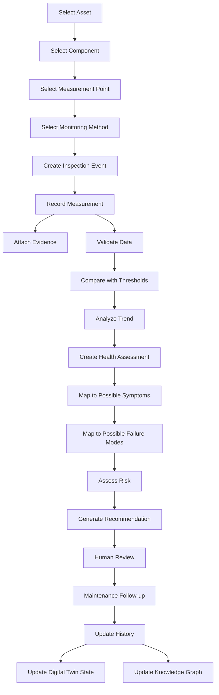
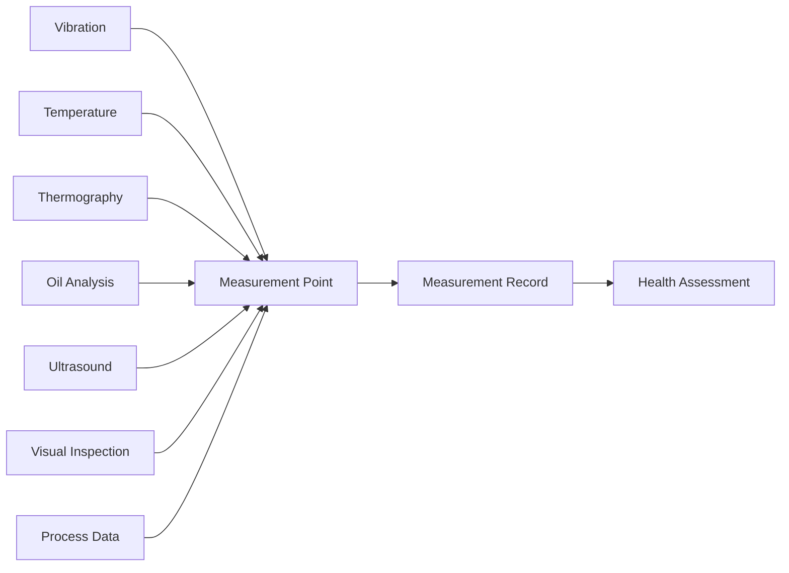
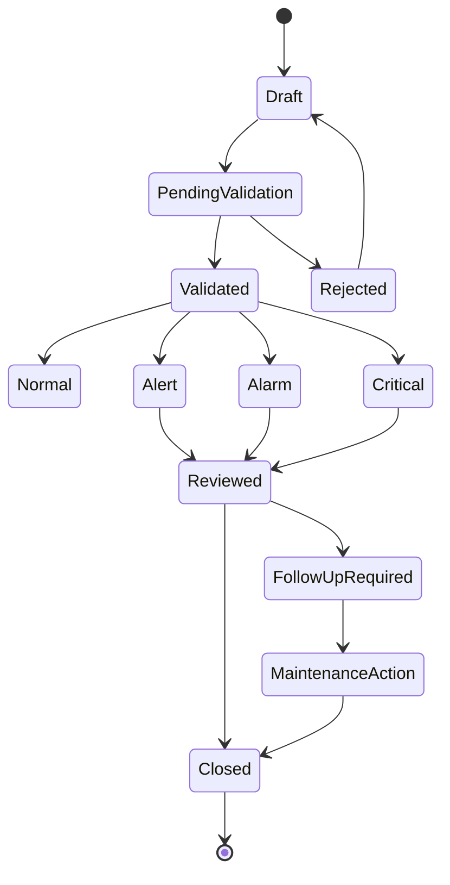
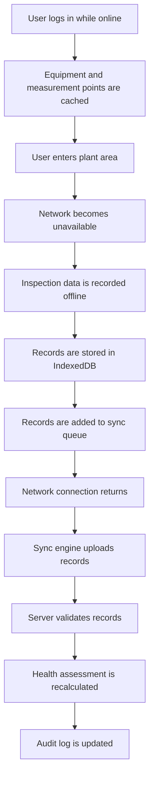

# ARIP Condition Monitoring Workflow Diagram

## Overview

This document provides the initial Condition Monitoring Workflow Diagram for ARIP — Autonomous Reliability Intelligence Platform.

The diagram shows how condition monitoring data moves from asset selection and measurement point selection to data recording, validation, threshold comparison, health assessment, failure mode mapping, and maintenance recommendation.

---

## Condition Monitoring Workflow

---

## Multimodal Monitoring Inputs

---

## Measurement Record Lifecycle

---

## Offline-First Condition Monitoring Flow

---

## Key Workflow Steps

### 1. Asset Selection

The user selects the relevant asset from the asset hierarchy.

Example:

* Plant
* Area
* System
* Equipment
* Component
* Measurement Point

---

### 2. Monitoring Method Selection

The user selects or follows a predefined monitoring method.

Examples:

* Vibration
* Temperature
* Thermography
* Oil analysis
* Ultrasound
* Visual inspection
* Process data

---

### 3. Measurement Recording

The user records condition data for the selected measurement point.

Examples:

* Vibration velocity
* Bearing temperature
* Oil viscosity
* Thermography hotspot temperature
* Ultrasound dB value
* Visual defect observation

---

### 4. Data Validation

The system validates the record based on:

* Required fields
* Unit consistency
* Measurement point correctness
* Timestamp correctness
* Instrument information
* Operating condition context
* Data quality status

---

### 5. Threshold and Trend Analysis

The system compares the record against:

* Normal baseline
* Alert threshold
* Alarm threshold
* Danger threshold
* Historical trend
* Similar equipment behavior

---

### 6. Health Assessment

The system creates a health assessment for the asset, component, or measurement point.

Possible health states:

* Normal
* Watch
* Warning
* Critical
* Unknown

---

### 7. Reliability Mapping

The condition monitoring result may be mapped to:

* Symptom
* Failure mode
* Root cause hypothesis
* Risk level
* Maintenance recommendation

---

### 8. Human Review

Engineering users should review important recommendations before maintenance action.

Human review may include:

* Accept recommendation
* Reject recommendation
* Correct failure mode
* Add engineering note
* Request additional inspection
* Create maintenance follow-up

---

## Relationship with ARIP Domains

Condition monitoring workflow connects to:

* Asset hierarchy
* Reliability intelligence
* Knowledge graph
* Digital twin
* Industrial AI
* Offline-first PWA
* Maintenance recommendation workflow

---

## Related Documentation

* [Condition Monitoring Domain Model](../../condition-monitoring/condition-monitoring-domain-model.md)
* [Asset Hierarchy Model](../asset-hierarchy-model.md)
* [Offline-First Architecture](../offline-first-architecture.md)
* [Reliability Intelligence Domain Model](../../reliability/reliability-intelligence-domain-model.md)
* [Knowledge Graph Concept](../../knowledge-graph/knowledge-graph-concept.md)
* [Digital Twin Concept](../../digital-twin/digital-twin-concept.md)
* [Industrial AI Concept](../../ai/industrial-ai-concept.md)
