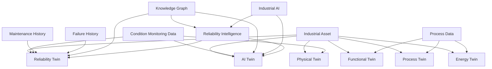
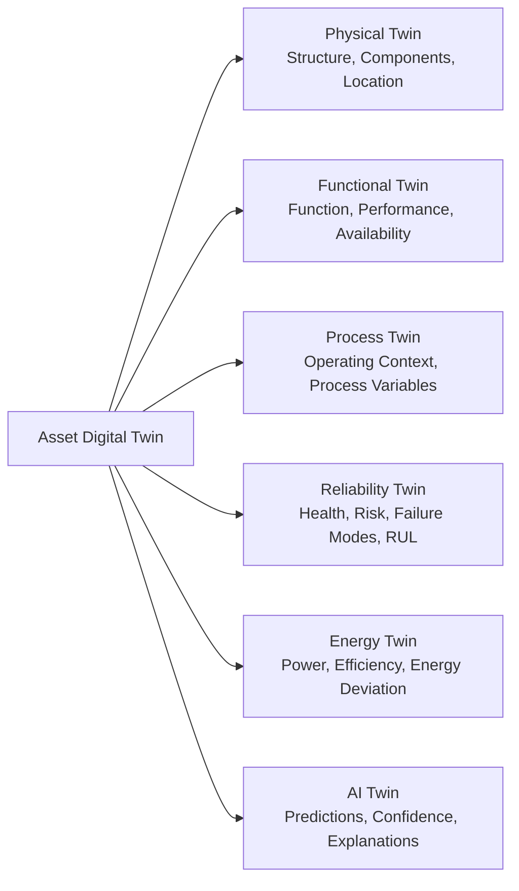
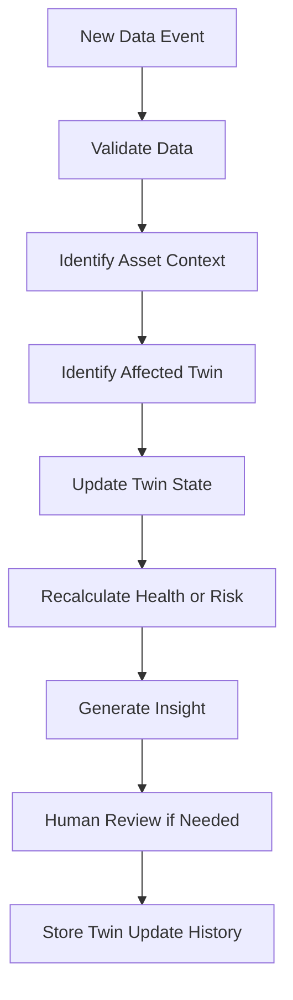
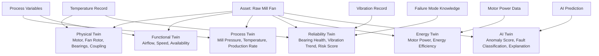
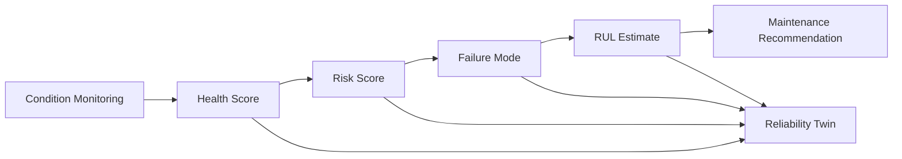
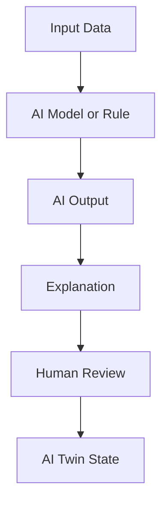

# ARIP Digital Twin Relationship Diagram

## Overview

This document provides the initial Digital Twin Relationship Diagram for ARIP — Autonomous Reliability Intelligence Platform.

The diagram shows how ARIP represents each industrial asset through multiple digital twin perspectives and how these twins are updated by condition monitoring, process data, reliability intelligence, industrial AI, and knowledge graph relationships.

---

## Digital Twin Relationship Model

---

## Six Digital Twin Perspectives

---

## Twin State Update Flow

---

## Example: Raw Mill Fan Digital Twin

---

## Digital Twin and Reliability Intelligence

---

## Digital Twin and AI Twin

The AI Twin stores AI-related interpretation for an asset.

It may include:

* Anomaly score
* Fault classification
* RUL prediction
* Confidence level
* Model version
* Explanation record
* Human review status
* Feedback result
* Model drift indicator

---

## Design Notes

ARIP treats digital twins as structured engineering state models, not only as 3D visualizations.

The first implementation should focus on:

* Asset state
* Component state
* Health state
* Risk state
* Process context
* Energy context
* AI interpretation
* Twin update history

Advanced simulation, 3D visualization, and physics-based modeling can be added after the core state model is stable.

---

## Relationship with ARIP Domains

The Digital Twin layer connects to:

* Asset hierarchy
* Condition monitoring
* Reliability intelligence
* Knowledge graph
* Industrial AI
* Offline-first inspection workflow
* Maintenance recommendation workflow
* Reporting and dashboards

---

## Related Documentation

* [Digital Twin Concept](../../digital-twin/digital-twin-concept.md)
* [Platform Architecture Diagram](platform-architecture.md)
* [C4 Container Diagram](c4-container.md)
* [Asset Hierarchy Diagram](asset-hierarchy.md)
* [Condition Monitoring Workflow Diagram](condition-monitoring-flow.md)
* [Reliability Intelligence Workflow Diagram](reliability-intelligence-flow.md)
* [Knowledge Graph Concept Diagram](knowledge-graph-concept.md)
* [Industrial AI Concept](../../ai/industrial-ai-concept.md)
