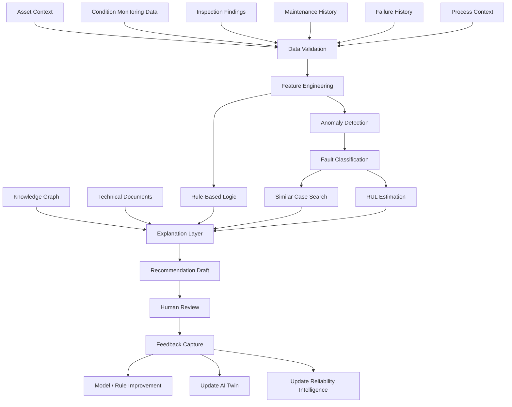
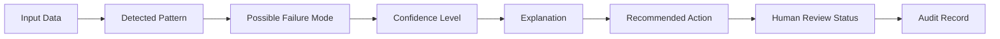
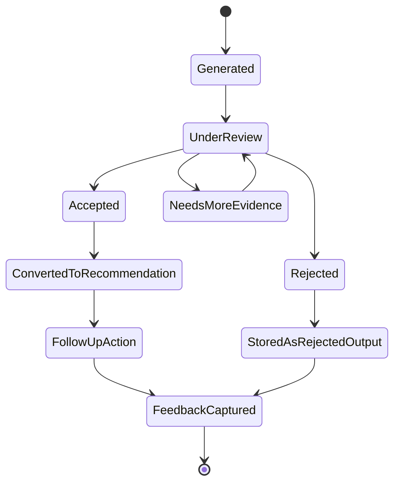
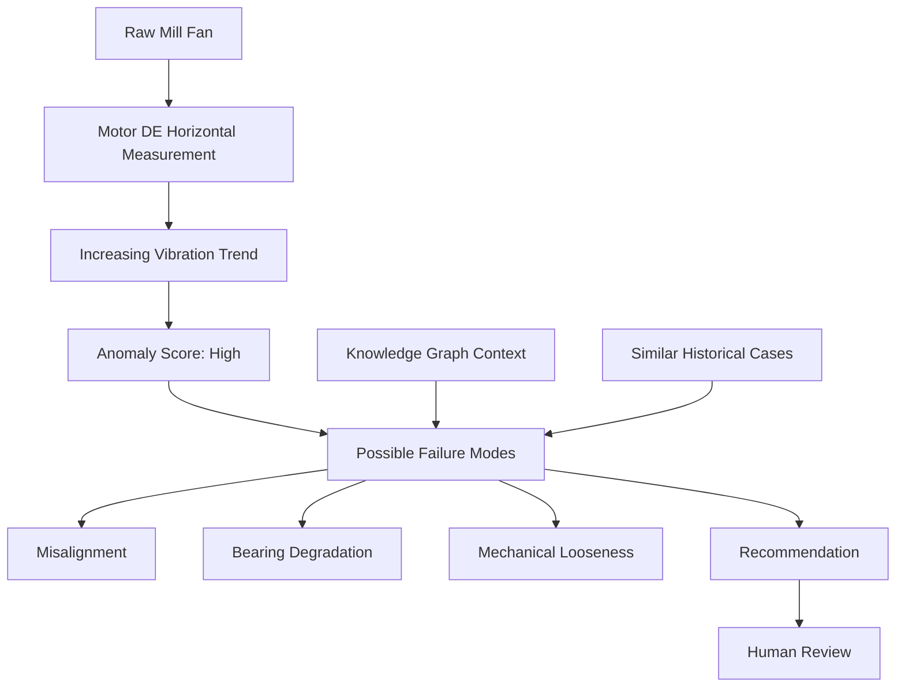

# ARIP Industrial AI Workflow Diagram

## Overview

This document provides the initial Industrial AI Workflow Diagram for ARIP — Autonomous Reliability Intelligence Platform.

The diagram shows how ARIP uses industrial data, asset context, condition monitoring records, knowledge graph relationships, reliability intelligence, and human feedback to support explainable AI-assisted diagnostics and maintenance decision support.

---

## Industrial AI Workflow

---

## Explainable AI Output Structure

---

## Human-in-the-Loop AI Review

---

## Example AI Diagnostic Path

---

## AI Data Inputs

Industrial AI in ARIP may use:

* Asset hierarchy
* Measurement points
* Vibration records
* Temperature records
* Thermography records
* Oil analysis records
* Ultrasound records
* Visual inspection observations
* Process data
* Maintenance history
* Failure history
* RCA records
* Knowledge graph relationships
* Technical documents
* Human feedback

---

## Initial AI Methods

The first implementation should remain practical and transparent.

Initial methods may include:

* Rule-based logic
* Threshold comparison
* Trend direction analysis
* Simple anomaly scoring
* Similar historical case search
* Explainable recommendation structure
* Human-reviewed feedback loops

Advanced machine learning should be added after enough structured and reliable industrial data is available.

---

## AI Output Requirements

Each AI output should include:

* Asset reference
* Component reference where applicable
* Measurement point reference
* Input data reference
* Detected pattern
* Suggested interpretation
* Possible failure mode
* Confidence level
* Explanation
* Recommended next action
* Human review status
* Rule or model version
* Timestamp

---

## AI Governance Requirements

ARIP should treat AI outputs as auditable engineering decision-support records.

Important governance requirements:

* Model or rule version tracking
* Input data traceability
* Explanation storage
* Human review status
* Feedback capture
* False positive tracking
* False negative tracking
* Data quality awareness
* Audit logging

---

## Relationship with ARIP Domains

Industrial AI connects to:

* Asset hierarchy
* Condition monitoring
* Reliability intelligence
* Knowledge graph
* Digital twin
* Offline-first inspection workflow
* Maintenance recommendations
* Reporting and dashboards

---

## Related Documentation

* [Industrial AI Concept](../../ai/industrial-ai-concept.md)
* [Reliability Intelligence Workflow Diagram](reliability-intelligence-flow.md)
* [Condition Monitoring Workflow Diagram](condition-monitoring-flow.md)
* [Knowledge Graph Concept Diagram](knowledge-graph-concept.md)
* [Digital Twin Relationship Diagram](digital-twin-relationship.md)
* [Architecture Overview](../architecture-overview.md)
