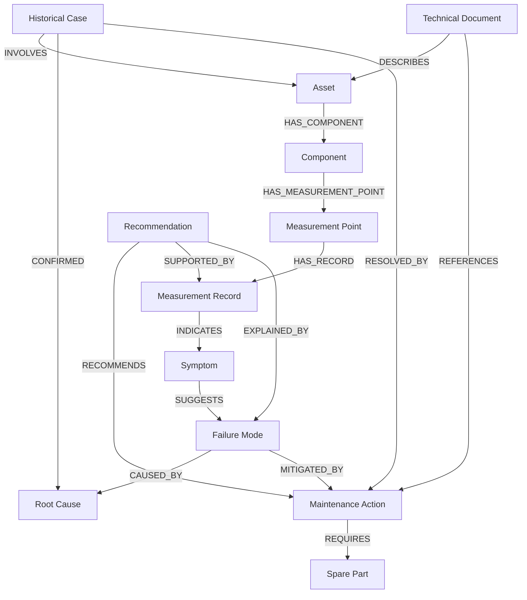
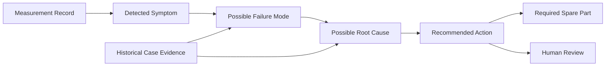
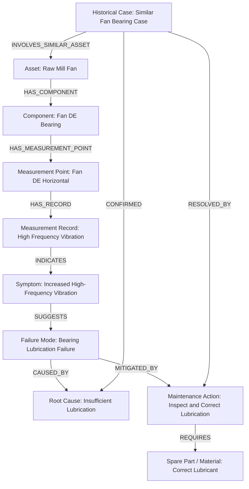
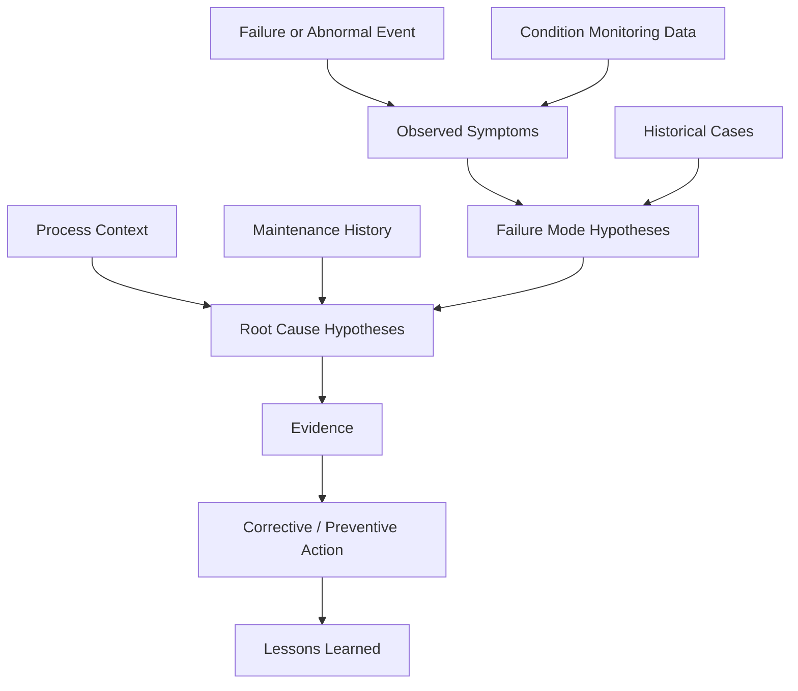

# ARIP Knowledge Graph Concept Diagram

## Overview

This document provides the initial Knowledge Graph Concept Diagram for ARIP — Autonomous Reliability Intelligence Platform.

The ARIP Knowledge Graph connects industrial reliability entities such as assets, components, measurement points, symptoms, failure modes, root causes, maintenance actions, spare parts, and historical cases.

The goal is to support explainable diagnostics, reliability reasoning, root cause analysis, similar case search, and knowledge-based maintenance recommendations.

---

## Core Knowledge Graph Model



---

## Diagnostic Reasoning Path



---

## Example: Fan Bearing Lubrication Problem



---

## Root Cause Analysis Support



---

## Knowledge Graph and Explainable AI

The Knowledge Graph supports explainable AI by providing traceable reasoning paths.

Example:

```text
Input:
High vibration was recorded at Fan DE Horizontal measurement point.

Graph reasoning path:
Measurement Record -> indicates Symptom
Symptom -> suggests Failure Mode
Failure Mode -> caused by Root Cause
Root Cause -> mitigated by Maintenance Action

Output:
The system recommends lubrication inspection because the measured symptom is connected to bearing lubrication failure and similar historical cases.
```

---

## Core Node Types

The first version of the ARIP Knowledge Graph should include:

* Asset
* Component
* Measurement Point
* Measurement Record
* Symptom
* Failure Mode
* Root Cause
* Maintenance Action
* Spare Part
* Historical Case
* Technical Document
* Recommendation

---

## Core Relationship Types

Initial relationship types may include:

* HAS_COMPONENT
* HAS_MEASUREMENT_POINT
* HAS_RECORD
* INDICATES
* SUGGESTS
* CAUSED_BY
* MITIGATED_BY
* REQUIRES
* INVOLVES
* CONFIRMED
* RESOLVED_BY
* DESCRIBES
* REFERENCES
* SUPPORTED_BY
* EXPLAINED_BY

---

## Relationship with ARIP Domains

The Knowledge Graph connects to:

* Asset hierarchy
* Condition monitoring
* Reliability intelligence
* Root cause analysis
* Digital twin state
* Industrial AI
* Maintenance recommendation workflow
* Technical documentation search

---

## Related Documentation

* [Knowledge Graph Concept](../../knowledge-graph/knowledge-graph-concept.md)
* [Reliability Intelligence Workflow Diagram](reliability-intelligence-flow.md)
* [Condition Monitoring Workflow Diagram](condition-monitoring-flow.md)
* [Asset Hierarchy Diagram](asset-hierarchy.md)
* [Industrial AI Concept](../../ai/industrial-ai-concept.md)
* [Digital Twin Concept](../../digital-twin/digital-twin-concept.md)
