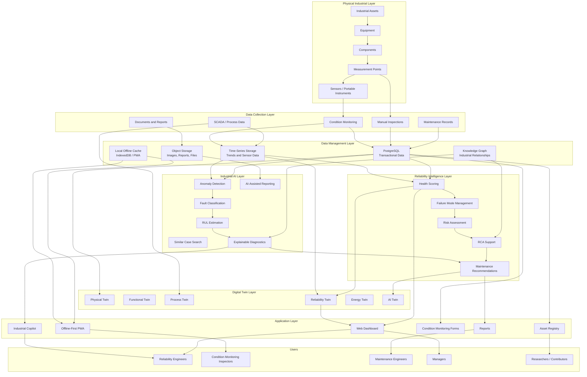

# ARIP Platform Architecture Diagram

## Overview

This document provides the first high-level platform architecture diagram for ARIP — Autonomous Reliability Intelligence Platform.

The diagram shows how industrial assets, inspection workflows, condition monitoring data, reliability intelligence, digital twins, knowledge graph, industrial AI, and user applications are connected.

---

## High-Level Platform Architecture

---

## Architecture Notes

ARIP follows an asset-centric and knowledge-centric architecture.

The platform connects:

* Industrial assets
* Measurement points
* Condition monitoring records
* Reliability intelligence
* Digital twin states
* Knowledge graph relationships
* Industrial AI outputs
* Human-reviewed maintenance decisions

The architecture is designed to support both online and offline-first workflows in industrial environments.

---

## Key Architectural Principles

* Asset-centric data model
* Offline-first field inspection
* Explainability-first AI
* Knowledge graph-supported diagnostics
* Digital twin-based asset state representation
* Vendor-neutral architecture
* Industrial cybersecurity awareness
* Open-source extensibility

---

## Related Documentation

* [Architecture Overview](../architecture-overview.md)
* [Asset Hierarchy Model](../asset-hierarchy-model.md)
* [Offline-First Architecture](../offline-first-architecture.md)
* [Condition Monitoring Domain Model](../../condition-monitoring/condition-monitoring-domain-model.md)
* [Reliability Intelligence Domain Model](../../reliability/reliability-intelligence-domain-model.md)
* [Knowledge Graph Concept](../../knowledge-graph/knowledge-graph-concept.md)
* [Digital Twin Concept](../../digital-twin/digital-twin-concept.md)
* [Industrial AI Concept](../../ai/industrial-ai-concept.md)
