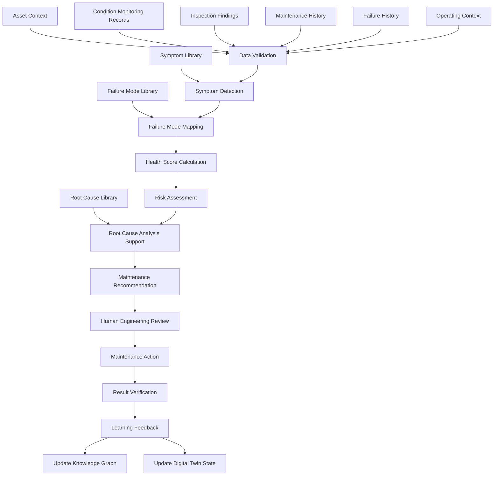
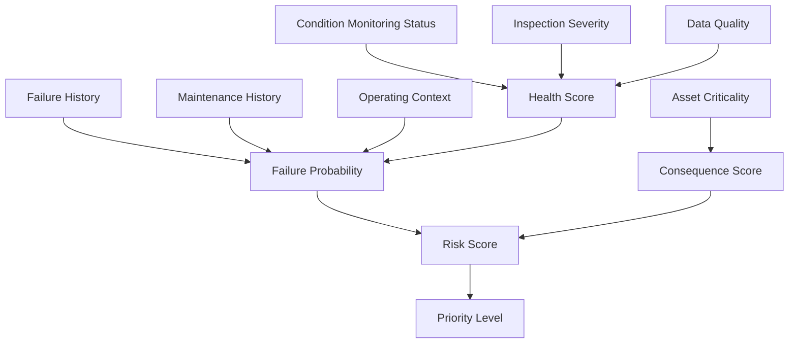
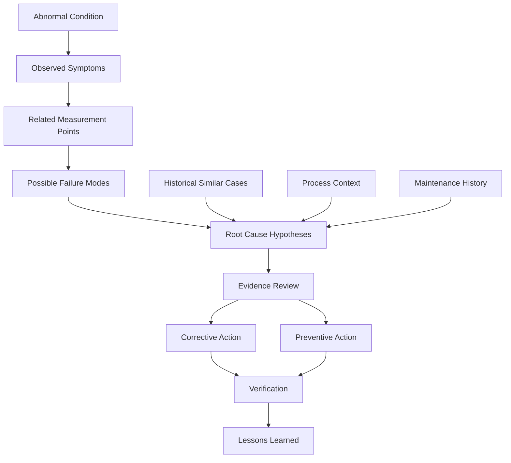
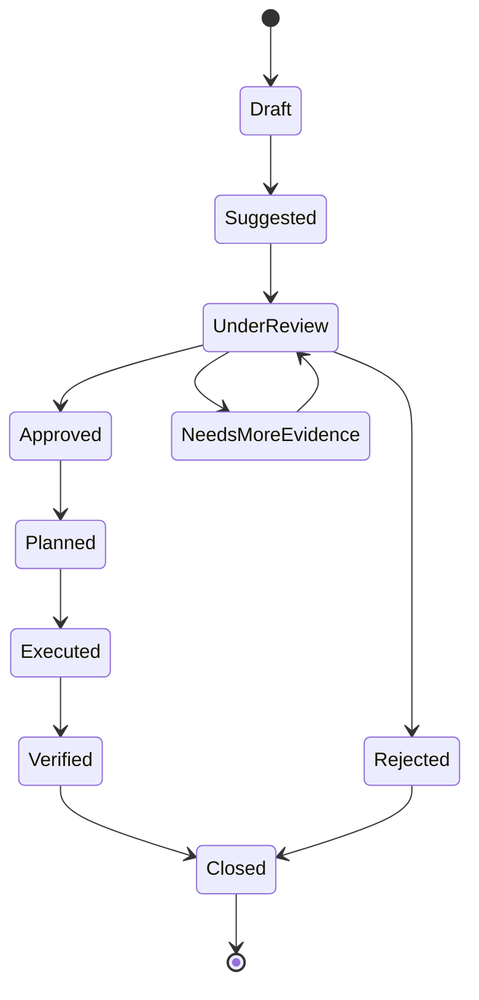

# ARIP Reliability Intelligence Workflow Diagram

## Overview

This document provides the initial Reliability Intelligence Workflow Diagram for ARIP — Autonomous Reliability Intelligence Platform.

The diagram shows how condition monitoring records, inspection findings, maintenance history, failure mode knowledge, and asset criticality are transformed into reliability decisions, risk assessment, root cause analysis, and maintenance recommendations.

---

## Reliability Intelligence Workflow

---

## Reliability Decision Chain

```mermaid
flowchart LR
    A["Measurement Record"]
    B["Detected Symptom"]
    C["Possible Failure Mode"]
    D["Possible Root Cause"]
    E["Risk Level"]
    F["Recommended Action"]
    G["Human Review"]
    H["Maintenance Follow-up"]
    I["Confirmed Learning"]

    A --> B
    B --> C
    C --> D
    D --> E
    E --> F
    F --> G
    G --> H
    H --> I
```

---

## Health Score and Risk Score Flow

---

## RCA Support Flow

---

## Maintenance Recommendation Lifecycle

---

## Key Reliability Intelligence Inputs

Reliability intelligence should consider multiple inputs.

### Asset Context

* Asset type
* Equipment criticality
* Location
* Operating role
* Production importance
* Safety relevance

### Condition Monitoring Data

* Vibration trends
* Temperature readings
* Thermography results
* Oil analysis results
* Ultrasound readings
* Visual inspection findings
* Process data context

### Maintenance and Failure History

* Past failures
* Repeat failures
* Maintenance actions
* Replaced components
* Repair quality notes
* Shutdown records
* Historical RCA reports

### Engineering Knowledge

* Failure modes
* Symptoms
* Root causes
* Maintenance actions
* OEM recommendations
* Standards references
* Expert knowledge

---

## Reliability Intelligence Outputs

ARIP may generate or support:

* Asset health score
* Component health score
* Risk score
* Priority level
* Possible failure modes
* Root cause hypotheses
* Maintenance recommendations
* RCA drafts
* Similar historical cases
* Follow-up actions
* Engineering review records

---

## Human Review Principle

Reliability intelligence in ARIP should support human engineering judgment.

Important recommendations should be reviewed by qualified personnel before being converted into maintenance actions, especially in safety-critical or production-critical situations.

Human review may include:

* Accept recommendation
* Reject recommendation
* Request additional inspection
* Correct failure mode
* Confirm root cause
* Add engineering note
* Create maintenance follow-up
* Close as false alarm

---

## Relationship with ARIP Domains

Reliability Intelligence connects to:

* Asset hierarchy
* Condition monitoring
* Knowledge graph
* Digital twin
* Industrial AI
* Offline-first inspection workflow
* Maintenance recommendation workflow
* Reporting

---

## Related Documentation

* [Reliability Intelligence Domain Model](../../reliability/reliability-intelligence-domain-model.md)
* [Condition Monitoring Workflow Diagram](condition-monitoring-flow.md)
* [Asset Hierarchy Diagram](asset-hierarchy.md)
* [Knowledge Graph Concept](../../knowledge-graph/knowledge-graph-concept.md)
* [Digital Twin Concept](../../digital-twin/digital-twin-concept.md)
* [Industrial AI Concept](../../ai/industrial-ai-concept.md)
